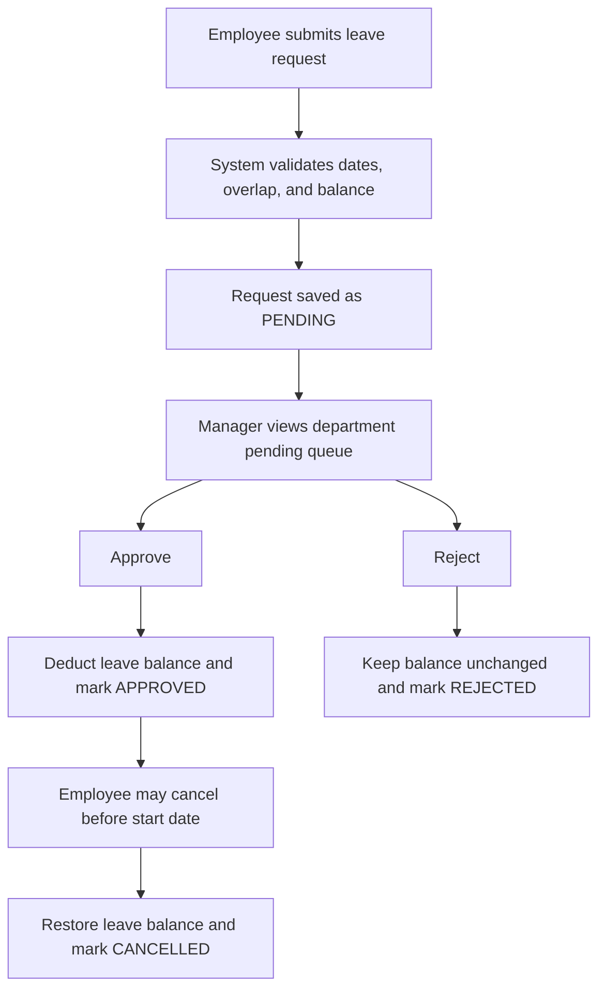
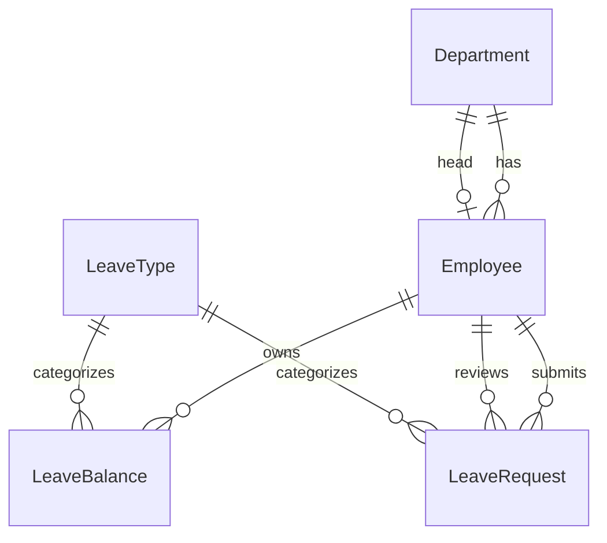

# Employee Leave Management System Report

## Workflow Diagram

## ER Diagram

## Demo Credentials

- Admin: `admin@leavehub.local` / `Admin@12345`
- Manager: `nandhini.v.2367@gmail.com` / `Demo@12345`
- Employee: `poorni@gmail.com` / `Demo@12345`

## Balance Deduction and Restoration

- Approval locks the request and matching `LeaveBalance` record in a transaction, validates balance again, then increments `used_days`.
- Cancelling an approved leave before its start date decrements `used_days` by `num_days`, restoring the employee's remaining balance.
- Pending-request cancellation changes only the request status and does not touch balances.

## Screenshots Checklist

- Employee dashboard: `/`
- Manager approval panel: `/`
- Admin console: `/admin/`
- API endpoints: use Django browsable responses or Postman on `/api/...`

## Git Log

- The current execution environment did not have Git CLI available, so commit history could not be generated from within this workspace.
